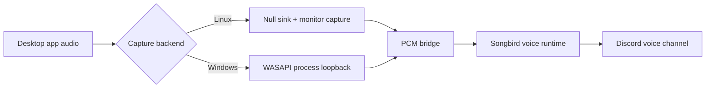

# Bardic Chord

<p align="center">
  
</p>

<p align="center">
  <strong>Route desktop audio into Discord voice with a guided local-first ritual.</strong>
</p>

<p align="center">
  Bardic Chord is a Rust desktop app with a native Slint UI that helps a user connect a Discord bot,
  choose an app to capture, and relay that audio into a Discord voice channel.
</p>

<p align="center">
  <a href="https://github.com/ICEFIR/bardic-chord/actions/workflows/ci.yml"></a>
  <a href="https://github.com/ICEFIR/bardic-chord/releases"></a>
  <a href="./LICENSE"></a>
  
  
  
</p>

## Why This Exists

Most Discord music bots feel remote, brittle, or overbuilt for a private hangout. Bardic Chord takes a different approach:

- the app runs on the user's machine
- audio stays local until it is relayed into Discord voice
- setup is guided through a desktop UI instead of scattered terminal steps
- Linux and Windows use native capture paths instead of trying to impersonate a Spotify Connect device

The current product direction is intentionally simple: capture local app audio well, route it clearly, and make the setup feel approachable.

## Feature Snapshot

| Area | What Bardic Chord does today |
| --- | --- |
| Guided setup | Walks the user through `Welcome`, `Discord`, `Desktop Audio`, and `Launch` |
| Discord | Validates a bot token, discovers guilds and voice channels, and joins voice through `serenity` + `songbird` |
| Linux capture | Creates a dedicated local output with `pactl`, captures the monitor stream with `parec`, and relays PCM into Discord |
| Windows capture | Uses WASAPI per-process loopback capture for the selected app |
| Local state | Stores settings and logs under `./.bardic-chord/` in the current working directory |
| Release flow | Builds Linux and Windows GNU release archives from Linux with `cargo xtask release` |

## How It Works



## The User Flow

1. Paste the Discord bot token.
2. Open the generated bot authorize page if the bot is not in the server yet.
3. Choose the Discord server and voice channel.
4. Choose the desktop app you want Bardic Chord to capture.
5. Prepare desktop audio.
6. Route the app to the Bardic Chord output on Linux, or keep the target app open on Windows so loopback capture can attach.
7. Start the party so Bardic Chord joins voice and forwards the local audio stream.

## Platform Status

| Platform | Status | Notes |
| --- | --- | --- |
| Linux x86_64 | Working | Uses PulseAudio or PipeWire-compatible null sink + monitor capture |
| Windows x86_64 GNU | Working | Uses WASAPI process loopback; cross-built from Linux with `cargo-zigbuild` |
| Linux ARM64 | Planned | Best added through a native ARM64 runner |
| macOS | Planned | Needs a native capture backend that fits the same flow |

## Current Tech Stack

- `slint`
  - native desktop UI
- `serenity`
  - Discord API and gateway client
- `songbird`
  - Discord voice transport and playback runtime
- `tokio`
  - async runtime
- `reqwest` + `rustls`
  - network stack and validation requests
- `symphonia`
  - PCM media/input support for the relay path
- `wasapi`
  - Windows application loopback capture

## Quick Start For Users

### Discord permissions

Current bot permissions integer:

```text
3146752
```

Current required permissions:

- `View Channels`
- `Connect`
- `Speak`

### Launch locally

```bash
cargo run -p bardic-chord
```

For the current POC, the Discord bot token is stored in Bardic Chord's local config file on the user's machine. It is not hard-coded into the binary, and it is not using OS keychain storage yet.

## Development

Check the workspace:

```bash
cargo check
```

Run unit tests:

```bash
cargo test -p bardic-chord --lib
```

Format the workspace:

```bash
cargo fmt --all
```

## Releases

Build both packaged release targets:

```bash
cargo xtask release
```

Build one target:

```bash
cargo xtask release --target linux
cargo xtask release --target windows
```

Prerequisites:

```bash
rustup target add x86_64-pc-windows-gnu
cargo install --locked cargo-zigbuild
```

Artifacts are written to `dist/`:

- `bardic-chord-x86_64-unknown-linux-gnu.tar.xz`
- `bardic-chord-x86_64-unknown-linux-gnu.tar.xz.sha256`
- `bardic-chord-x86_64-pc-windows-gnu.zip`
- `bardic-chord-x86_64-pc-windows-gnu.zip.sha256`

Release tagging:

- push code to `main` to run CI
- run the GitHub Actions workflow `Tag Release` with a version like `v0.1.0`, or push a `v*` tag manually
- the `Release` workflow rebuilds the archives and uploads them to the GitHub release for that tag

## CI/CD

GitHub Actions currently covers the repo lifecycle:

- `CI`
  - runs on pushes to `main` and on pull requests
  - checks formatting, builds the workspace, runs desktop unit tests, and packages Linux and Windows release archives
- `Tag Release`
  - manual workflow used to create an annotated `v*` tag from GitHub
- `Release`
  - runs on `v*` tag pushes, rebuilds both release archives, uploads workflow artifacts, and publishes GitHub release assets

## Repo Layout

- `Cargo.toml`
  - workspace root
- `desktop/Cargo.toml`
  - native app crate
- `desktop/src/backend.rs`
  - Discord, capture, config, and relay orchestration
- `desktop/src/lib.rs`
  - Slint controller wiring
- `desktop/ui/app.slint`
  - guided desktop UI
- `xtask/`
  - release packaging automation

## Project Direction

- keep the setup local-first and simple
- keep the UX guided and explicit
- keep the backend Rust-first
- prefer local audio capture over fragile Spotify Connect receiver workarounds
- make cross-platform release packaging boring and repeatable

## Roadmap

- [ ] add a macOS capture backend
- [ ] polish screenshots and release-page media
- [ ] make capture target selection more flexible beyond Spotify defaults
- [ ] improve release coverage for more architectures

## Acknowledgements

Bardic Chord builds on and learns from several open-source projects. Thanks to their maintainers and contributors.

- `slint`
  - native desktop UI runtime used for the app shell and guided setup flow
- `serenity`
  - Discord API and gateway client
- `songbird`
  - Discord voice transport and audio playback runtime
- `tokio`
  - async runtime used throughout the app
- `reqwest`
  - HTTP client for Discord API validation
- `rustls`
  - TLS backend used by the network stack
- `symphonia`
  - PCM media/input support used in the relay path
- `wasapi`
  - Windows process loopback capture backend
- `librespot`
  - earlier experiments and product direction research around Spotify playback handling
- `aoede`
  - earlier reference point while exploring Spotify-to-Discord relay patterns
- `Spytify`
  - useful reference for the Windows direction around isolating Spotify audio specifically: https://github.com/spytify/spytify

## License

This repository is released under the MIT License. See `LICENSE`.
